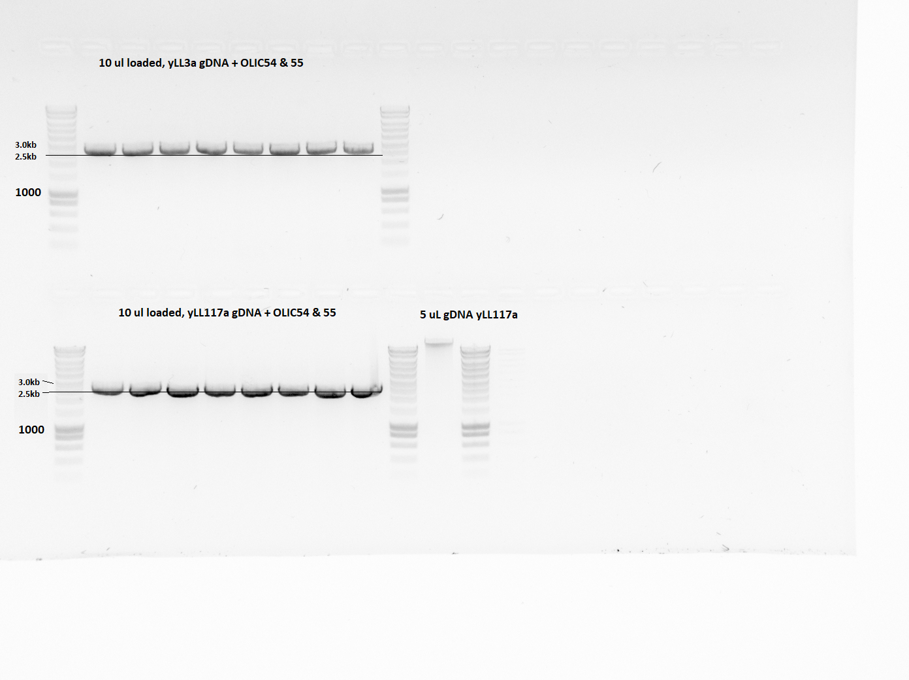

# PCR of genomic DNA from yLL117a  

## Date 
05/03/21 - 09/03/21

## Objective
- To be able to have the PCR product containing the KanMX cassette on bem1 loci to be able to transform into dbem3 strain. 

## Method
- Incubation of yeast cells (yLL117a) in liquid YPD for several days until a dense culture has formed. Incubating 2*10ml and negative control.
- Genomic DNA extraction of yLL17a popultion using kit (GeneMATRIX gram plus & yeast genomic DNA purification kit). 
- Using ~18 ml worth of pellet over 10 epis. Using 30uL Elution buffer per epi (80C). 
- Combinined all DNA into 1 epi.
- Checked extracted DNA concentration with nanodrop.

- Performed PCR on extracted yLL117a DNA and previously extracted yLL3a DNA using primers OLIC54 and OLIC55 on both. These primers flank the gene BEM1, they are like 500 bp away from the insertion part, from each side. 
  - Used volume: 50 uL per PCR tube. 8 tubes per DNA using a temperature gradient from 55C to 65C.
- Large gel (110V for 30min) to check presence, length and concentration of  in PCR product. Loaded 10uL per lane, except gDNA (5uL)

## Results
Nanodrop measurement of gDNA yLL117a:
- 60.4 ng/uL. 
- 260/280: 1.88, 
- 260/230: 1.16

{#fig:gel_PCR}

## Conclusion
- Based on the nanodrop measurement and gel, the DNA extraction of yLL117a was succesful.  See @fig:gel_PCR `reference to the figure`
- A 260/280 of 1.88 suggests the DNA is not pure (~1.8 is pure DNA), but also contains RNAs (2.0 is pure RNA). 260/230 of 1.16 would also indicate contamination (2.0-2.2 expected for pure Nucleic acids)
- The gel shows PCR product for both yLL3a and yLL117a as expected and for all annealing temperatures.
-  yLL3a contains BEM1 and with primers OLIC54 and 55 should have a length of 2.7kb. yLL117a contains a construct in place of BEM1 and and with primers OLIC54 and 55 should have a length of 2.5 kb. 
-  These expected lengths correspond with observed lengths. This suggests we have sucessfully obtained PCR product of a BEM1delete construct from yLL117a.

