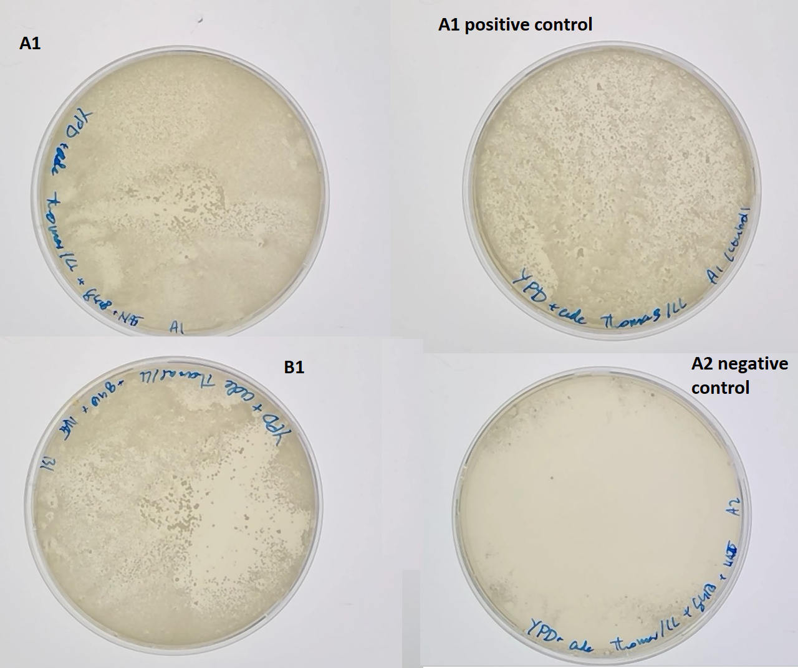

# Transforming yLIC137_2 to contain bem1 del

## Date
11/03/21 -  

## Objective
- Obtain cells with bem1d in the yLIC137(bem3::NAT ade2- ura3-) background by introducing a PCR product containing the KanMX cassette on the bem1 loci. 

## Method

- PCR an existing bem1::KanmX cassette from a different strain and transform it into ylic137.
- Protocols:
    - gDNA extraction
    - PCR 
    - Yeast Transformation 

### Base for selection media 

- [x] Created 20 agar plates with YPD + adenine
    - Autoclave 300ml with MiliQ+Agar

| Amount         | Type         |
|----------------|--------------|
| 300 ml         | MiliQ         |
| 8 g            | agar         |

    - Add by filter stilirization the rest of the components

| Amount         | Type          |
|----------------|---------------|
| 4 g            | Yeast extract |
| 8 g            | bacto-peptone |
| 0.044 g        | adenine       |
| 60mL           |MiliQ          |
| 40 ml          | 20% dextrose  |

- pipet 20 ml per plate (sterile). Store at 4C after solidifying.
- Controls:
    -  Check for non pink colonies from yLIC133 (WT) long 30C incubation. 

### Growth of yLIC137_2 in liquid YPD+ade

- 2 tubes with 10 ml YPD+6xade + 2% dex (from Leila) and yLIC137_2. 
- Put to incubate at 30C

### Transformation

- Create selection plates: Adding 40 ul G418 and 20 ul clonNAT (antibiotics) to YPD+ade plates. Spread with glass beads, allowed to dry (upside down, a few hours)
- Perform transformation following protocol P.24 High Efficiency Tranformation of Yeast v 1.0

- Cell concentration of both liquid yLIC137_2 cultures with nanodrop (step 2):

cells diluted 2x

| Colony         | measured OD   | Actual OD   |
|----------------|  ---------------|-------------|
| A              | 0.198         | 0.396       |
| B              | 0.158         | 0.316       |

- Allow to incubate for 4 hours (step 4 of transformation protocol)
cells diluted 10x

| Colony         | measured OD   | Actual OD   |
|----------------|---------------|-------------|
| A              | 0.257         | 2.57        |
| B              | 0.207         | 2.07        |

- Concentration of used purified PCR product: 2ug 
- One negative control (non DNA added)
- plated out volume onto prepared selective plates (A1: 800uL, B1: 1ml, control: 200uL of A1). incubated at 30C for 3 days

### New Base for selection media 

- [x] Created 20 agar plates with YPD + adenine
    - Autoclave 360ml YP + agar + adenine

| Amount         | Type         |
|----------------|--------------|
| 360 ml         | MiliQ        |
| 4 g            | Yeast extract|
| 8 g            | bacto-peptone|
| 8 g            | agar         |
| 0.022 g        | adenine      |

Added after autoclaving:

| Amount         | Type          |
|----------------|---------------|
| 40 ml          | 20% dextrose  |

- [x] Created 5 agar plates with YPD + adenine + G418 + clonNAT
    - Autoclave 90ml YP + agar + adenine

| Amount         | Type         |
|----------------|--------------|
| 90 ml          | MiliQ         |
| 4 g            | Yeast extract |
| 8 g            | bacto-peptone |
| 8 g            | agar         |
| 0.022 g        | adenine       |

Added after autoclaving:

| Amount         | Type          |
|----------------|---------------|
| 10 ml          | 20% dextrose  |
| 200 ul         | G418          |
| 100 ul         | clonnat       |

- pipet 20 ml per plate (sterile). Store at 4C after solidifying.
- Controls (to do):
    -  Check for non pink colonies from yLIC133 (WT) long 30C incubation. 

## Results

- A1 and B1 both show growth. A1 shows a region where colony density is low. Probably a result of higher local antibiotic concentrations. Positive control plate (plated on plain YPD) shows growth. Negative control plate (A2) shows some growth at the edges. Probably where concentration of antibiotic was very low. 

{#fig:plates}

### Colony PCR #1
- New selection plates: Adding 50uL G418 and 30uL clonNAT. Spread with glass beads and allowed to dry.
- Selected 7 individual colonies from A1 plate and 1 from B1 plate (marked). Scraped and suspended in 50uL milliQ. Restreaked on newly made selection plates by stirring tip in epi.

#### PCR protocol:
- Protocol
    - T=65 annealing temperature
    - 1 min in 98C 
    - 5 uL of cell suspension as template
- Performed PCR for all 8 samples using 5uL of suspended cells as template and primers OLIC54 & 55: loaded 10uL per lane. Ran gel at 120V for 30 min.

- A1, B1 (from which colonies were picked) are stored at 4C with parafilm for later use.

- DNA gel shows DNA bands at 2.5kb and 2.0kb for each colony, at varying concentrations. several bands around 200bp are also observed.

{#fig:gel_PCR1}

- All the restreaked cells combined show only 2 colonies in total after 3 days of growth.
    - It seems there were very few living cells with the construct on the pipette tip or almost none. 

### Colony PCR #2

Colonies taken:
- small(2)
- medium(4)
- large (2)

- Cells were resuspended in 50uL milliQ. 40 uL of cell suspension pipetted on antibiotic plates and incubated at 30C for multiple (4) days.

#### PCR protocol:

- Protocol
    - T=60 annealing temperature
    - 3 min in 98C 
    - 5 uL of cell suspension as template 
    - Q5 DNA polymerase and Phusion DNA polymerase
    - Primers OLIC 56 and 57

{#fig:gel_PCR2}

- Again the restreaked cells show no colonies 
- A positive control of yLL118_A also showed no colonies on anitbiotic plate after 3 days incubation at 30C.

### Restreaking 18 colonies on YPD+ade plates
Check for growth without antibiotics. Colonies that grow will be suspended and grown in liquid media with G418 and clonNAT. 

### PCR 3 and 4(to do)
Using new primers inside the construct (KanMx gene): kanmx-out-upstream and KanMx-out-downstream. 
Primer combiations: 
1: OLIC56 & KanMx-out-upstream (1323 bp). 
2: KanMx-out-downstream & OLIC 57 (1767 bp)

## Conclusion

- The growth of yeast on selection plates suggests our transformation has been sucessful as cells show resistance to the used antibiotics. 

- The presence of 2.5kb bands suggests that that our DNA has been inserted into the genome.
- The location of the insertion is not determined. Requires other primers, outside the transformation product, which have been ordered (15/03/21). 

- Bands at 2kb and around 200bp are possibly non-specific product of the PCR. By first performing a genome purification and then the PCR we may learn more.

- The restreaked colonies showed no growth. Possibly the number of cells in solution was too low. Repeat experiment with new colonies and streak 40uL volume of cell suspension with glass beads. 

