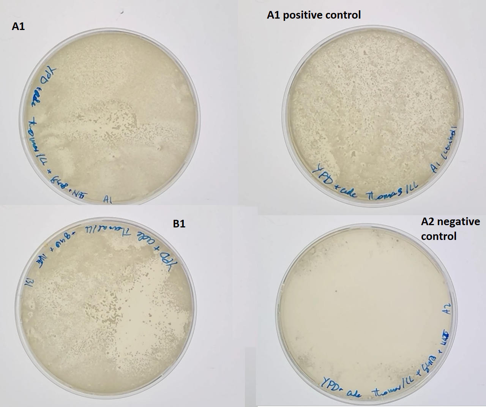

# Transforming yLIC137_2 to contain bem1 del

## Date
11/03/21 -  

## Objective
- Obtain cells with bem1d in the yLIC137(bem3::NAT ade2- ura3-) background by introducing a PCR product containing the KanMX cassette on the bem1 loci. 

## Methods & Results 

### Overview methods
- PCR an existing bem1::KanmX cassette from a different strain and transform it into ylic137.
- Check succes of transformation with PCR and southern blot
- Protocols:
    - gDNA extraction
    - PCR 
    - Yeast Transformation 

### Base for selection media 

- [x] Created 20 agar plates with YPD + adenine
    - Autoclave 300ml with MiliQ+Agar

| Amount         | Type         |
|----------------|--------------|
| 300 ml         | MiliQ         |
| 8 g            | agar         |

    - Add by filter stirilization the rest of the components

| Amount         | Type          |
|----------------|---------------|
| 4 g            | Yeast extract |
| 8 g            | bacto-peptone |
| 0.044 g        | adenine       |
| 60mL           |MiliQ          |
| 40 ml          | 20% dextrose  |

- pipet 20 ml per plate (sterile). Store at 4C after solidifying.
- Controls:
    -  Check for non pink colonies from yLIC133 (WT) long 30C incubation. 

### Growth of yLIC137_2 in liquid YPD+ade

- 2 tubes with 10 ml YPD+6xade + 2% dex (from Leila) and yLIC137_2. 
- Put to incubate at 30C

### Transformation

- Create selection plates: Adding 40 ul G418 and 20 ul clonNAT (antibiotics) to YPD+ade plates. Spread with glass beads, allowed to dry (upside down, a few hours)
- Perform transformation following protocol P.24 High Efficiency Tranformation of Yeast v 1.0

- Cell concentration of both liquid yLIC137_2 cultures with nanodrop (step 2):

cells diluted 2x

| Colony         | measured OD   | Actual OD   |
|----------------|  ---------------|-------------|
| A              | 0.198         | 0.396       |
| B              | 0.158         | 0.316       |

- Allow to incubate for 4 hours (step 4 of transformation protocol)
cells diluted 10x

| Colony         | measured OD   | Actual OD   |
|----------------|---------------|-------------|
| A              | 0.257         | 2.57        |
| B              | 0.207         | 2.07        |

- Concentration of used purified PCR product: 2ug 
- One negative control (non DNA added)
- plated out volume onto prepared selective plates (A1: 800uL, B1: 1ml, control: 200uL of A1). incubated at 30C for 3 days

### New Base for selection media 

- [x] Created 20 agar plates with YPD + adenine
    - Autoclave 360ml YP + agar + adenine

| Amount         | Type         |
|----------------|--------------|
| 360 ml         | MiliQ        |
| 4 g            | Yeast extract|
| 8 g            | bacto-peptone|
| 8 g            | agar         |
| 0.022 g        | adenine      |

Added after autoclaving:

| Amount         | Type          |
|----------------|---------------|
| 40 ml          | 20% dextrose  |

- [x] Created 5 agar plates with YPD + adenine + G418 + clonNAT
    - Autoclave 90ml YP + agar + adenine

| Amount         | Type         |
|----------------|--------------|
| 90 ml          | MiliQ         |
| 4 g            | Yeast extract |
| 8 g            | bacto-peptone |
| 8 g            | agar         |
| 0.022 g        | adenine       |

Added after autoclaving:

| Amount         | Type          |
|----------------|---------------|
| 10 ml          | 20% dextrose  |
| 200 ul         | G418          |
| 100 ul         | clonnat       |

- pipet 20 ml per plate (sterile). Store at 4C after solidifying.
- Controls (to do):
    -  Check for non pink colonies from yLIC133 (WT) long 30C incubation. 

#### Transformation results

- Selection plates A1 and B1 both show growth. A1 shows a region where colony density is low. Probably a result of higher local antibiotic concentrations. Positive control plate (plated on plain YPD) shows growth. Negative control plate (A2) shows some growth at the edges. Probably where concentration of antibiotic was very low. 

{#fig:selectionPlates}

### Colony PCR (#1)
- New selection plates: Adding 50uL G418 and 30uL clonNAT. Spread with glass beads and allowed to dry.
- Selected 7 individual colonies from A1 plate and 1 from B1 plate (marked). Scraped and suspended in 50uL milliQ. Restreaked on newly made selection plates by stirring tip in epi.
- Selection plates A1, B1 (from which colonies were picked) are stored at 4C with parafilm for later use.

#### PCR protocol:
- T=65 annealing temperature
- 1 min in 98C 
- 5 uL of cell suspension as template
- primers OLIC54 & 55

#### Southern blot
- Loaded 10uL per lane. Ran gel at 120V for 30 min.
- DNA bands at 2.5kb and 2.0kb for each colony, at varying concentrations. several bands around 200bp are also observed.
- To confirm correct location of insertion, we need to use other primers which are oustide of the primers used for the transformation.

{#fig:snapgeneConstruct}

{#fig:gel_PCR1}

#### Re-streak results
- All the restreaked cells (from Colony PCR #1) combined show only 2 colonies in total after 3 days of growth.
    - It seems there were very few living cells with the construct on the pipette tip or almost none. 
- We therefore need to redo the colony PCR with new colonies.

### Colony PCR #2

Colonies taken:
- Small(2)
- Medium(4)
- Large (2)

- Cells were resuspended in 50uL milliQ. 
- 40 uL of cell suspension pipetted on antibiotic plates
- Incubated at 30C for multiple (4) days.

#### PCR protocol

- Protocol
    - T=60 annealing temperature
    - 3 min in 98C 
    - 5 uL of cell suspension as template 
    - Q5 DNA polymerase and Phusion DNA polymerase
    - Primers OLIC 56 and 57

#### Southern blot

{#fig:gel_PCR2}

- Primers OLIC 56 and 57 do not allow for proper determination of success as positive and negative band lengths are very similar. 
- We will do a PCR with new primers which can conclusively determine sucess of the transformation.

#### Re-streak results
- Again the restreaked cells show no colonies 
- A positive control of yLL118_A also showed no colonies on antibiotic plate after 3 days incubation at 30C.
- As re-streaks repeatedly fail, we will attempt a new re-streak with more colonies and initially without antibiotics

### Re-streaking 18 colonies 
- 18 single colonies from the transformation plate on YPD+ade plates
- Incubated at 30C.
- Check for growth without antibiotics. Colonies that grow will be suspended and grown in liquid media with G418 and clonNAT. 

#### Results
- 15/18 Restreaked colonies showed growth on YDP + ade plate. 
- A colony of each of the 15 plates was suspended and incubated in 5 ml liquid YPD + ade media with G418 and clonNAT. 
- After 2 days of incubation, no cells were visible in any tube. After 3 more days this was still true.
- We will attempt to re-streak many colonies rather than single colonies

### Re-streaking (serial dilution in plate)
- Restreaking a large number of cells from many colonies. Increasingly fewer cells streaked in 4 quadrants
- Two YPD + ade plates. One with G418 and clonnat, one without.
- Incubated at 30C.

#### Results
- Both plates showed growth, with less on the antibiotics plate.

{#fig:plates2}

### Suspension of re-streaked cells of plate with antibodies
- Four colonies were selected from the antibiotic plate
- Cells suspended in 10ml liquid media (YPD + ade + G418 + clonnat) 
- Incubated at 30C.

#### Results
- Cultures of colonies 1-3 were dense after incubation.
- Culture of colony 4 and negative control showed no growth
- 1ml of cultures of colonies 1-3 were added to 500uL 80% glycerol and stored at -80 (strains yTW001A-C, respectively). 

### Genome extraction of yTW001 A, B and C
- Genomic extraction performed with kit (name)
- Pellet of 8ml dense culture used per strain variant 
- 30uL elution used.
- Insufficient proteinase K: samples 1-1 through 3-2 with proteinase K (+), samples 4-2 through 4-3 without (-). 

#### Results
- Nanodrop measurements of DNA concentrations:

| Sample | Concentration (ng/ul) | 260/280 | 260/230 |
|-|-|-|-|
| A | 53.4 | 1.94 | 2.17 |
| B (+) | 77.2 | 1.94 | 1.11 |
| B (-) | 44.9 | 1.94 | 1.99 |
| C | 63.6 | 1.96 | 1.44 |

### PCR to check the edges of the insertion

- Using new primers inside the construct (KanMx gene):  
- kanmx-out-upstream (OLIC59) and KanMx-out-downstream (OLIC58). 
- See @fig:snapgeneConstruct for the location of OLIC58 and 59

#### PCR protocol:

Primer pairs: 
1: OLIC56 & OLIC59 (positve: 1323 bp) 
2: OLIC57 & OLIC58 (positve: 1767 bp)
3: OLIC56 & OLIC57 (positive: 3.1kb, negative: 3.3kb)

- 10uL loaded
- Annealing temperature: 60C
- 30s in 98C 
- All combinations of gDNA samples and primer pairs.
- WT3a gDNA with primer set 3 as a control

#### Results

{#fig:210330_PCR}

- Gel of PCR products: Figure @fig:210330_PCR 
- The construct appears to have been sucessfully integrated.
- The primers inside KanMX do not seem to work properly for this temperature. We will attempt to redo the PCR with a temperature gradient.

#### Optimizing the PCR 
- PCR repeated for primer pairs 1 and 2. gDNA of strain yTW001A
- temperature gradient PCR: 55C to 65C

#### Results

### PCR to check the edges of the construct with new primers
- Primers oLL29 and oLL30, previously reported to work well
- Primers OLIC60 and OLIC61, made according to blastn primers suggestion
- See @fig:snapgeneConstruct for the location of primers oLL 29,30 and OLIC60, 61

#### protocol
Primer pairs: 
1: OLIC56 & OLIC60 (positive: 1629 bp) 
2: OLIC57 & OLIC61 (positive: 1506 bp)
3: oLL29 & OLIC57 (positive: 1536 bp)
4: oLL30 & OLIC56 (positive: 1643 bp)

- templates: gDNA of TW001A, B, C and yLL3a for negative control
- Annealing temperature: 60C
- 30s in 98C 
- All combinations of gDNA samples and primer pairs.
- yLL3a (erroneously noted as WT3a) gDNA with primer set 3 as a control

#### Results

- oLL29 and oLL30 seem promising, will repeat PCR for these primers

### PCR To check the edges and entire construct again & prepare for sequencing the construct
- Obtain 400uL of PCR product of the construct to ensure we can get a sufficiently high concentration of DNA for sequencing
- Add positive and negative controls (yLL117, yLL3a)

#### PCR protocol
Primer pairs: 
1: oLL29 & OLIC57 (positive: 1536 bp)
2: oLL30 & OLIC56 (positive: 1643 bp)
3: OLIC56 & OLIC57 (positive: 3.1kb, negative: 3.3kb)

#### Results

![Biological replicates A B and C for primers oLL29 & OLIC57 (downstream edge) all show a clear band at 1.5kb, which is the expected length. The same is true for the positive control, while the negative control shows no bands, as expected. A slightly larger can also be observed, the origin of which is unclear. For primers oLL30 & OLIC56 (upstream edge) the biological replicates and the positive control show a single band at or slightly larger than 1kb. This is not the expected length of 1.5kb. The negative control shows no band as expected. Finally, for primers OLIC56 & OLIC57 (entire construct) the biological replices, (with the possible exception of A) show a band at 3.1kb as expected. The negatve control shows a slightly larger band, around 3.3kb as expected ](../images/210413_PCR_yTW001ABC_annotated.png){#fig:PCR_final}

 - Except for oLL30 & OLIC56, The PCR products all show the expected length
 - Almost no other bands are present
 - This indicates the transformation has worked. 
 - To confirm this, we will send the PCR product of OLIC56 & OLIC57 for sequencing. 
 - To do so we first need to increase the DNA concentration.

### DNA purification of PCR product of OLIC56 & OLIC57
- Using monarch kit to purify DNA for sequencing

#### DNA purification protocol
- 10uL elution used (heated to 50C)
- 4 times a volume of 95uL per biological replicate (A,B,C)
- Using Buffer 2 : 1 DNA sample. So 190uL buffer per epi

#### Results
| Sample | Concentration (ng/ul) | 260/280 | 260/230 |
|-|-|-|-|
| A | 218.5 | 1.90 | 2.28 |
| B | 168.0 | 1.88 | 2.24 |
| C | 199.9 | 1.88 | 2.37 |

### Sending purified DNA of PCR product of OLIC56 & OLIC57 for sequencing
- 250 ng DNA per tube
- one primer (OLIC56, OLIC57) added per tube

#### Protocol
| - | A | B | C |
|-|-|-|-|
| 250ng DNA | 1.14 uL | 1.49 uL | 1.25 uL |
| Primer (10uM) | 2.5 uL  | 2.5 uL | 2.5 uL |
| MilliQ | 6.36 uL | 6.01 uL | 6.25 uL |

| Primer | A | B | C |
|-|-|-|-|
| OLIC56 | 1FEAZAA192 | 1FEAZAA188 | 1FEAZAA190 |
| OLIC57 | 1FEAZAA189  | 1FEAZAA187 | 1FEAZAA191 |

#### Results

### Repeat sending purified DNA of PCR product of OLIC56 & OLIC57 for sequencing using different primers
- 250 ng DNA per tube
- one primer (oLL29, oLL30) added per tube

#### Protocol
| - | A | B | C |
|-|-|-|-|
| 250ng DNA | 1.14 uL | 1.49 uL | 1.25 uL |
| Primer (10uM) | 2.5 uL  | 2.5 uL | 2.5 uL |
| MilliQ | 6.36 uL | 6.01 uL | 6.25 uL |

| Primer | A | B | C |
|-|-|-|-|
| oLL29 | 1FEAZAA186 | 1FEAZAA184 | 1FEAZAA182 |
| oLL30 | 1FEAZAA185  | 1FEAZAA183 | 1FEAZAA181 |

#### Results

![Biological replicates A B and C with primers oLL29 and oLL30. Alignments of the sequencing data show the resulting sequences both go upstream. This clashes with previous observation of PCR product. Furthermore, we see that the alignment of one sequence is accurate exactly within the construct, but not outside of it. The other alignment is only accurate exactly outside the construct. This suggests that the KanMX construct is inserted in the correct location, but the pTEF promotor side is downstream rather than upstream](../images/sequencingDataConstructBEM1d2.png)

-Attempt to flip the construct and check alignment

Construct flipping procedure:
- Zoom in on one side of the sequence to be flipped.
- Select sequence
- Create a feature touching but not overlapping the sequence to be flipped (optional)
- Select the entire sequence to be flipped
- cut the sequence
- Find back your feature and select after the last base on the side where the construct was/should be
- press edit -> insert -> bases
- copy the cut sequence
- enable reverse complement
- press insert

## Conclusion

- The growth of yeast on selection plates from Figure @fig:selectionPlates suggests our transformation has been sucessful as cells show resistance to the used antibiotics. 
- The presence of 2.5kb bands in Figure @fig:gel_PCR1 suggests that that our DNA has been inserted into the genome.
- The location of the insertion is not determined. This requires primers outside the transformation product, which have been ordered (15/03/21). 
- Bands at 2kb and around 200bp are possibly non-specific product of the PCR. By first performing a genome purification and then the PCR we may learn more.

- The presence of possible 3.1kb bands in Figure @fig:gel_PCR2 suggests that that our DNA has been inserted into the genome, but the negative and postive lengths are difficult to distinguish. Therefore we will use primers inside the PCR product.

- The restreaked colonies showed no growth. Possibly the number of cells in solution was too low.
- The inside primers OLIC58,59,60 and 61 do not show convincing bands of the expected length
- primers oLL29 and oLL30 are known to work well and give clear bands, if not of the expected length
- Sequencing the PCR product of oLIC56 and oLIC57 should give definite confirmation.

- Sequencing data from primers oLL29, oLL30. oLI56 and oLIC57 all show the entire construct is integrated at the expected location in flipped orientation

- Flipping the construct means the inside primers change direction
- This would cause the lack of expected bands for primers OLIC58 through 61 and oLL29 and oLL30
- Based on sequencing results, oLL29 goes to upstream of the construct and primer oLL30 goes downstream of the construct. So our expectation of the primer direction was wrong for these primers.
- OLIC56 - oLL30: expected length of 1371 bp
- OLIC57 - oLL29: expected length of 1688 bp
- This corresponds better with observed lengths of bands in Figure @fig:PCR_final (no necessarily perfectly)

- The transformation was sucessful.
