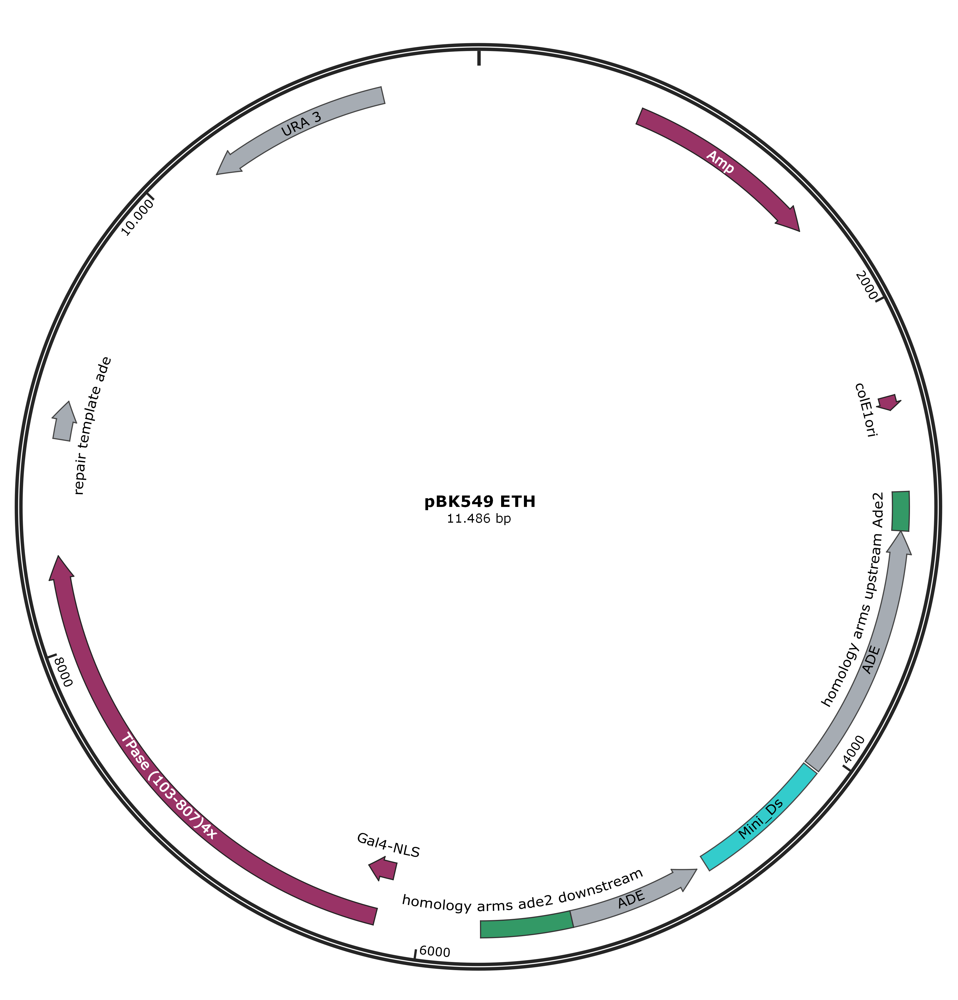

# Transforming yTW001 and yLIC137 to contain the SATAY plasmid

## Date
21/04/21 -  

## Objective
- Obtain cells with the SATAY plasmid (pBk549) in the yTW001(bem3::NAT bem1::KanMX ade2- ura3-) background and yLIC137 (bem3::NAT ade2- ura3-) by transformation with the plasmid.

## Methods & Results 

### Overview methods
- Transform SATAY plasmid (pBk549) into yTW001 and yLIC137
- Check success of transformation (Formation of some colonies in -ura plates)
- pbk549 plasmid 

Protocols: 
    - Yeast Transformation

### Base for selection media

- [x] Create 20 agar plates (400ml) of CSM - ura + ade
    - Autoclave 300ml MiliQ+Agar

| Amount         | Type         |
|----------------|--------------|
| 300 ml         | MiliQ        |
| 8 g            | agar         |

    - Add by filter stirilization the rest of the components

| Amount         | Type          |
|----------------|---------------|
| 0.76 g         | YNB           |
| 0,308 g        | AA dropout mix -URA |
| 0.044 g        | adenine       |
| 60mL           | MiliQ         |
| 40 ml          | 20% dextrose  |

### Controls for plates 
- Checking for positive and negative growth 
- **Explain this more , with the genotypes of those strains because that is what tell you what is a positive and negative control**
- Check plates with yWKD017 (+), yWKD001(-), yLIC135(-)

## Transformation with SATAY plasmid
- Following protocol P.24 High Efficiency Transformation of Yeast

- Incubate yTW001 and yLIC137 YPD+ade at 30C for a day
- Measure OD for 100x diluted culture

| Sample | yTW001A | yTW001B | yTW001C | yLIC137_1 | yLIC137_2A |
|-|-|-|-|-|-|
| OD | 0.311 | 0.304 | 0.291 | 0.313 | 0.283 |

- Used YPD+ade stock was contaminated --> Repeat. 

- Incubate yTW001 and yLIC137 in YPD+ade at 30C for a day
OD measurement with Nanodrop at 100x dilution

| Sample | yTW001A | yTW001B | yTW001C | yLIC137_1 | yLIC137_2A |
|-|-|-|-|-|-|
| OD | 0.001 | -0.002 | -0.004 | 0.073 | 0.056 |

- Protocol: dilute to OD = 0.5 (5*10^6 cells/ml)
- yTW001 strains need to incubate longer.
- Therefore transformation continued only for yLIC137 strains

- yLIC137_1: OD=7.3 (7.3 * 10^7 cells/ml) -> dilute 15 times
- yLIC137_2: OD=5.6 (5.6 * 10^7 cells/ml) -> dilute 10 times

| Sample | yLIC137_1 | yLIC137_2A |
|-|-|-|
| Culture (ml) | 0.66 | 1 |
| YPD+ade (ml) | 9.34 | 9 |

- Incubate for ~4 hours until OD = 2 (2*10^7 cells/ml)
- OD measurement with Nanodrop at 10x dilution after 80 minutes:

| Sample | yLIC137_1 | yLIC137_2A |
|-|-|-|
| OD | 0.056 | 0.076 |

- OD after ~4 hours:
| Sample | yLIC137_1 | yLIC137_2A |
|-|-|-|
| OD | 0.133? | 0.170 |

- Transformation started
- At step 11 of the protocol: split into 2 epis per strain (technical(?) replicates, denoted as yLIC137_X_1 and yLIC137_X_2 )
- Plasmid concentration used for transformation: 0.63 ng/uL (3uL of 73,9 ng/ul added to 348 uL tranformation mix) 
- Plating: 
  - Step 17: resuspended in 0.25 ml H20
  - plate 200uL (denoted as yLIC137_X_XA) and 110 uL (10 ul sample in 100ul milliQ, denoted as yLIC137_X_XB) on -Ura + Ade plates
  - incubate for 3 days at 30C

## Results

- All 8 selection plates showed colonies.
- As expected plates with diluted tranformation mix showed less colonies.

## Transformation of yTW001
- Following protocol P.24 High Efficiency Transformation of Yeast

- Incubate yTW001 in YPD+ade at 30C for a day
- OD measurement with Nanodrop at 2x dilution

| Sample | yTW001A | yTW001B | yTW001C |
|-|-|-|-|-|-|
| OD | 0.024 | 0.113 | 0.127 |

- Protocol: dilute to OD = 0.5 (5*10^6 cells/ml)
- Current OD is below 0.5 -> incubate longer.

- After ~5 hours of incubation at 30C
- OD measurement with Nanodrop at 10x dilution

| Sample | yTW001A | yTW001B | yTW001C |
|-|-|-|-|-|-|
| OD | 0.039 | 0.140 | 0.174 |

- Incubate for 1 more hour
- OD measurement with Nanodrop at 10x dilution

| Sample | yTW001A | yTW001B | yTW001C |
|-|-|-|-|-|-|
| OD | 0.047 | 0.178 | 0.208 |

- Transformation started with yTW001B and C
- Plasmid concentration used for transformation: 0.63 ng/uL (3uL of 73,9 ng/ul added to 348 uL tranformation mix) 
- Plating: 
  - Step 17: resuspended in 0.25 ml H20
  - plate 200uL (denoted as yLIC137_X_XA) and 110 uL (10 ul sample in 100ul milliQ, denoted as yLIC137_X_XB) on -Ura + Ade plates
  - incubate for 3 days at 30C
- Note: At step 11 of the protocol: centrifuged for 15 s rather than 5
- Note: At step 14 of the protocol: The waterbath had not cooled enough so samples were left for 15 additional minutes at 30C (45 min in total)

## Results

- Not good results, apparent contamination: 

Selection plates of yTW001 show strange colonies. They appear very liquid and are not according to expectation. The plates do not smell like yeast, or bacteria. 10 uL on diluted cells was put under the microscope. This showed yeast cells and some unidentified cells. A restreak of the colonies showed the same phenotype. Transformation will be repeated.

- Pictures of plates 

## Sanity check

- Plate 8 single colonies from selection plates on both -Ade and -Ura plates.
- First plate on -Ade, then plate the cells from the same colony on -Ura
  - Initially I plated different colonies on -Ade (1-8) and -Ura (9-16), but it should come from the same colony -> repeat this step

Logic behind the sanity check:
- Growth on -Ade should be possible by the rare random recombination of the transposon repairing the ADE2 gene in the plasmid. While possible it should be very unlikely. Therefore we select the colonies which show more than 0 colonies on -Ade, but otherwise as few as possible.
- The growth of the same colony in -Ura is then checked. Presence of the plasmid should provide growth on -ura plates, while a lack of the plasmid should result in no growth. Therefore we look for colonies with very slight growth in -ade and large growth in -ura.

## observations 12/05
Media was contaminated. Transformation of yTW001 delayed. New YPD+ade and dextrose was made.

YPD+ade

| Amount         | Type         |
|----------------|--------------|
| 360 ml         | MiliQ        |
| 4 g            | Yeast extract|
| 8 g            | bacto-peptone|
| 0.022 g        | adenine      |

Added after filtering:

| Amount         | Type          |
|----------------|---------------|
| 40 ml          | 20% dextrose  |

20% dextrose
| Amount         | Type          |
|----------------|---------------|
| 100 ml         |      H2O      |
| 40 g           |      dextrose |
| add to 200 ml  |      H2O      |

## 17-05
- Previous media was contaminated. 
- New media was made while taking extra care to work sterile. 
- Previous glucose concentration was under 20% so new 20% dextrose was made.
- Previously 20% glucose was made by adding 40g of glucose to 200ml of H20. However, dissolving sugar adds to the volume, so the final concentration of glucose is below 20%. To achieve a 20% glucose concentration the glucose is dissolved in 100ml H20, after which H20 is added until the total volume is 200ml
- yTW001A,B,C put to incubate in YPD + ade at 30C

## 19-05
- OD of incubated cultures measured at 10:00
- 100x diluted:

| Sample | OD | Concentration of culture
|-|-|-|
| A | 0.049 | 4.9*10^7/ml|
| B | 0.056 | 5.6*10^7/ml |
| C | 0.061 | 6.1*10^7 /ml|

- Dilute 10x and incubate at 30C
- 10x diluted yTW001A shows OD of 0.375 rather than expeccted 0.49. This means we will have a slight underestimation of cell count.

- OD of diluted culture measured at 13:15
- 10x diluted 

| Sample | OD | Concentration of culture
|-|-|-|
| A | 0.067 | 6.7*10^6/ml|
| B | 0.058 | 5.8*10^6 /ml|
| C | 0.065 | 6.5*10^6/ml |

- Incubate further
- OD of diluted culture measured at 14:30

| Sample | OD | Concentration of culture
|-|-|-|
| A | 0.099 | 9.9*10^6/ml|
| B | 0.077 | 7.7*10^6 /ml|
| C | 0.095 | 9.5*10^6/ml |

- Incubate further
- OD of diluted culture measured at 15:30

| Sample | OD | Concentration of culture
|-|-|-|
| A | 0.136 | 1.36*10^7/ml|
| B | 0.094 | 9.4*10^6 /ml|
| C | 0.125 | 1.25*10^7/ml|

- Incubate further
- OD of diluted culture measured at 16:40

| Sample | OD | Concentration of culture
|-|-|-|
| A | 0.198 | 1.98*10^7/ml|
| B | 0.132 | 1.32*10^7/ml|
| C | 0.177 | 1.77*10^7/ml|

- Start of transformation
  - Plasmid concentration used: 0.63 ng/uL (3uL of 73,9 ng/ul added to 348 uL tranformation mix)
  - Step 17: resuspended in 0.25 ml H20
  - Plated 200uL and 110 uL (10 ul sample in 100ul milliQ) using glass beads. 
  - 200uL plates denoted as yTW001X_1, the diluted plates are denoted as yTW001X_2
  - Note: I was in a hurry during plating here which might have affected how secure I worked. In the future I should make sure not to work until 8 to prevent this.
  - Note: Volume of boiled ssDNA was insufficient so more had to be prepared, probably as a result of the ssDNA tube being nearly empty. In the meantime cells were in the transformation mix. To prevent this in the future I should make double check if I pipette the correct volume when tubes are nearly empty.

- Incubate for 2 days at 30C. 
- Plates stored at room temperature over the weekend to allow for slight growth to compensate for the missed 3rd day of 30C incubation

  
  