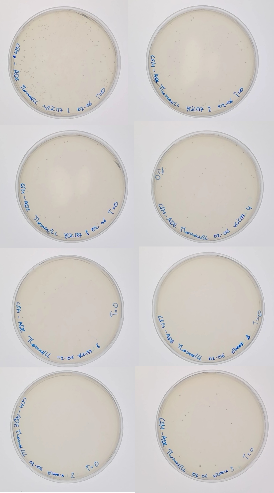
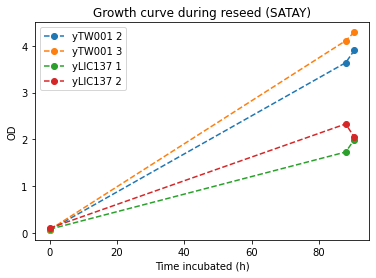
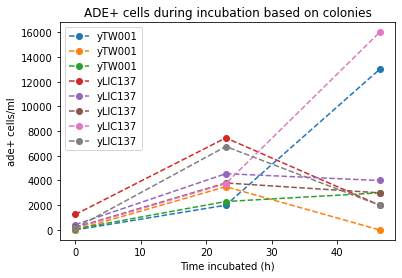

​
# Title : 300521-SATAY_of_yLIC137_and_yTW001
​
## Date
30052021 - 
​
## Objective
​
- To perform SATAY on bem3d (yLIC137) and bem1bem3d (yTW001) strains.
​
## Method
​
- **30052021**
    - Preparing media and plates
    (ADD DETAILS FROM LOGBOOK)

- **01062021**
    - Preculture in SD-URA+Ade+0.2%glucose +2% raffinose
        - Scrape from the colonies from each background that passed the sanity check
        - 20ml media in flask
        - Incubate at 30C, 180 RPM

    - Some flasks fell over on the shaker as they did not stick well enough to the surface. 
    - Repeat above, use a different shaker with better sticky pads.
    - Preculture in SD-URA+Ade+0.2%glucose +2% raffinose at 16:50

- **02062021**
    - Prepare 8*150=1200ml SD-Ura+Ade+2% galactose
        - Initially I did not make enough media. Then the media had to be autoclaved and cool down enough

    - Removed flasks from incubator at 17:05 (incubated ~24h )
    - Density of all flasks seems similar by eye
    
    - Measure the background (T=0 of induction)
    ​    - [x] Plate 200ul of the inoculum in SD-ADE+ 2% dextrose (expect 40-80 colonies per 200uL)
    ​    - [x] Dilute 1000x and spread 200ul in SD-URA and CSM + ADE

    

    - Goal: Start induction: Dilute cells to OD of 0.2 in SD-Ura+Ade+2% galactose
    - Diluted yLIC137 5 10x (15 ml in 135ml media)
    - OD measurement: 

    | Strain  |  OD 10x dilution  | ReaL OD | Dilution Factor to OD=0.2  | Time of preculture|
    |-|-|-|-|-|
    | ylic137 5 | 0.539 |  5.39 | 27  | 24h  |

    - Diluted all strains 27x times
    - OD measurement: 

    | Strain  |  ReaL OD |
    |-|-|
    | yTW001 1 | 0.077 |
    | yTW001 2 | 0.047 |
    | ylic137 3 | 0.068 |

    - **It seems I diluted too much**. While I expected to get an OD slightly below 0.2 this is far below 0.2
    - Low cell count at the start of induction may affect library complexity
    - Continue with induction for now. 
    - Start induction at 19:30. Induce for 50h
    - **If I repeat this experiment, measure all ODs both before and after and dilute more carefully!**

- **03062021** 

    - Measure the rate of induction (T=Xh of induction)
      - [x] Plate 200ul of the inoculum 10x diluted in SD-ADE+ 2% dextrose (expect 40-80 colonies per 200uL)
      - [x] Dilute 1000x and spread 200ul in SD-URA and CSM + ADE
      - [x] Check OD

- [x] Dissolve 4*2.34g of CSM-ade + 4*5.7g of YNB in 200ml MQ and filter sterilize it 
- [x] Prepare 4 flasks of 3L of SD-ADE media for the reseed of four strains
    - Per flask of 3L:
    - [x] Add 2,65L MiliQ to flask and autoclave
    - [x] Add 50ml SC-ADE media to autoclaved MiliQ flask 
    - [x] Add 300mL of 20% dextrose after autoclaving. 

- OD measurement afer (T=23) hours

| Strain  |  OD 10x dilution  | ReaL OD |
|-|-|-|
| yTW001 1 | | 6.28 | 
| yTW001 2 | | 7.30 |
| yTW001 3 | | 5.39 |  
| ylic137 1 | | 8.35 |
| ylic137 2 | | 5.51 |
| ylic137 3 | | 6.51 |
| ylic137 4 | | 6.93 |
| ylic137 5 | | 9.24 |
​
​

- **04062021**
 - Preparing 20 SC-ADE, SC-URA+ADE and CSM+Ade plates 
 - Preparing 4* 300ml of 20% glucose again (correct this time)
 - Preparing 4*2.34g of CSM-ade + 4*5.7g of YNB in 200ml MQ
    - After ~2 hours of mixing the mixture remained opaque, clearing upon filtering. This suggests not evrything was dissolved.

- OD measurement afer (T=46.5) hours

| Strain  |  OD 200x dilution  | ReaL OD |
|---|---|---|
| yTW001 1 | | 7.60 | 
| **yTW001 2** | | **9.70** |
| **yTW001 3** | | **8.16** |  
| **ylic137 1** | | **10.44** |
| **ylic137 2** | | **9.88** |
| ylic137 3 | | 9.24 |
| ylic137 4 | | 8.86|
| ylic137 5 | | 9.64 |

- Choose the 4 strains to continue for the reseed that has the least number of ADE+ cells at T=0 and the highest number of ADE+ after induction.
  - Still the background at T=0 can not be clearly determined.
  - Use highest OD for reseed (indicated in bold)
  - Start reseed with OD of 0.1: dilute 80-100x. 
  - Add 50ml of innoculum to 3L media flask. Actual dilution: ~60x
  - Incubate at 30C, 120 rpm

- **08062021**
- [] Check ADE+ cells during induction. Counting colonies from each plate. 
  - Image J protocol: 
    1. select image of interest: circle tool and edit-> clear outside (clear so that just all text is removed)
    2. Image ->  Type -> 16bits
    3. Make sure to capture the maximum number of right colonies: Image -> Adjust -> Threshold . Make sure the colonies are all red.
    4. Process -> Make binary-> Watershed
    5. Analyse ->  Analyse Particles, select minimum size of 2 pixels   (?)

**- YOU SHOULD PUT THE DILUTION YOU ARE USING IN EACH PLATE SO YOU CAN PROPERLY COMPUTE THE NUMBER OF CELLS IN EACH PLATE**

| plate&strain | t=0 | t=23 | t=46.5 |
|-|-|-|-|
| SC-ADE yTW001 1  | 0 | 40 | 13 |
| SC-ADE yTW001 2 | 0 | 70 | 0 |
| SC-ADE yTW001 3  | 14 | 46 | 3 |
| SC-ADE yLIC137 1  | 250 (105?)| 149 | 2 |
| SC-ADE yLIC137 2 | 85 | 91 | 4 |
| SC-ADE yLIC137 3 | 40 |  | 3 |
| SC-ADE yLIC137 4 | 28 |  | 16 |
| SC-ADE yLIC137 5 | 28 |  | 2 |
| CSM+ADE yTW001 1  |  |  | 19 |
| CSM+ADE yTW001 2 |  |  | 7 |
| CSM+ADE yTW001 3 |  |  | 17 |
| CSM+ADE yLIC137 1 |  |  | 2 |
| CSM+ADE yLIC137 2 |  |  | 24 |
| CSM+ADE yLIC137 3 |  |  | 2 |
| CSM+ADE yLIC137 4 |  |  | 60 |
| CSM+ADE yLIC137 5 |  |  | 24 |
| SC-URA+ADE yTW001 1 |  |  |  |
| SC-URA+ADE yTW001 3 |  |  |  |
| SC-URA+ADE yTW001 3 |  |  |  |
| SC-URA+ADE yLIC137 1 | 223 |  |  |
| SC-URA+ADE yLIC137 2 |  |  |  |
| SC-URA+ADE yLIC137 3 |  |  |  |
| SC-URA+ADE yLIC137 4 |  |  |  |
| SC-URA+ADE yLIC137 5 |  |  |  |

OD measurement of the reseed 

| Strain |  t = 88h | t=90.5 |
|-|-|-|
| yTW001 2 | 3.64 | 3.9 |
| yTW001 3 | 4.11 | 4.29 |
| yLIC137 1 | 1.73 | 1.99 |
| yLIC137 2 | 2.33 | 2.05 |

- End of reseeding after 90.5 hours
- [x] Harvest of the cell culture.
  - Centrifuge 1L for 20 min at 4500rpm
  - Move pellet to 50ml centrifuge tube
  - Centrifuge 10 min at 3000rpm
  - 5-10ml of pellet, frozen in -80C. The pellet is pink

  

- [x] Plate 200ul with 1000X dilution in SD-Ade , and 200ul with 40000X dilution in SD-ura to estimate the growth of ade+cells compared with the T=0 of reseeding. Expect  that the ade+ cells have grown by a factor of ~1000x. 

  - Library to reseed
  - [Rule of thumb for the number of cells under certain OD600](https://research.fhcrc.org/content/dam/stripe/hahn/methods/yeast_genetics/yeast_OD_cells.pdf) 
​

  | OD  |  approx Number of cells in 1mL| 
  |---|---|
  | 0.1 | 3,000,000  |
  | 0.18 | 6,000,000  |
  | 0.25  | 7,500,000 |
  | 0.27  | 7,500,000 | 
  | 1| 30,000,000 | 

​| strain  | OD at T=0 (reseed)| Volume | Library |
|---|---|---|---|
| yTW001 2 | 0.064  | 3L | 3000* 1,920,000 = 5.76*10^9|
| yTW001 3 | 0.070  | 3L | 6.3*10^9|
| yLIC137 1  | 0.079 | 3L | 7.11*10^9|
| yLIC137 2  | 0.104 | 3L | 9.36*10^9|
 

| Strain 	| OD START 	| OD STOP 	| ADE+/mL-start induct(backg) 	| ADE+/mL-start Reseed 	| ADE+/ml-stop Reseed 	| URA+/ml-stop Reseed 	| % of ade+/ura+ 	| Total # of cells Harvest 	| Time- Reseeding 	|
|-	|-	|-	|-	|-	|-	|-	|-	|-	|-	|
| yTW001 2 	|  0.064	| 3.9 	| 0	|  0	|  	|  	| 	| 	| 90.5h	|
| yTW001 3 	|  0.070	| 4.29 	| 70	|  3000	|  	|  	| 	| 	| 90.5h	|
| yLIC137 1 	| 0.079 	| 1.99	| 1250	| 2000 	|  	|  	| 	| 	| 90.5h	|
​| yLIC137 2 	|  0.104	| 2.05	| 425	| 4000 	|  	|  	| 	| 	| 90.5h	|
​
​----------------------------------------- BELOW: LEILA

#### Defining the complexity of the library

​
- The number of ADE+ cells reseeded minus the number of background ADE+ cells is the complexity of the library.

​
- To determine the complexity of the library, you should know: 
  - #ADE+ per ml at the start of the reseed, 
  - Volume of reseed.  
  - If you harvest all the culture: 

​
For strain 1:
​
- OD8 ~8E+7 cells/ml -> 7.47E+11/ 8E+7~10L
​
- The  number of URA+ cells per ml at the end of the regrowth is 19200000 -> 7.47E+11/ 19.2E+5 ~ 38L

​
- I reseed in a volume of 3L :
​
  If so, the complexity of the library is 5E+3 * 3*10E+3= 1.5E+7
- Complexity = $ADE+|_{T=0(reseed)}$ * Volume of reseed
​

#### Number of cycles during the reseed
​

- The number of cycles that each ADE+ cells has done during the regrowth of the libraries as follow:
​
  - N=ln(#ADE+ per ml STOP reseed/#ADE+ per ml START reseed)/ln(2)
​
  - N_ WT=9.34
  - N_dnrp1_1=9.06
  - N_dnrp1_2=8.67
​
​
## Results
​
- For the strain ylic135 it did not work, because it is very miserable to culture with others. It grows much more slower , so maybe growing it more and with less volume , for next time. Also ylic135 gives a relatively high background compared with the growth in -URA. 

​
- The way of computing the number of colonies in highly dense plates is pretty inaccurate with the best tool to do it which is ImageJ. So I think that is why I get like an order of magnitude lower than the number of colonies expected by Benoit. 
​
-  The pellet from the reseed culture was pink , which could mean that there were many cells ade- that did not have any transposon event. Hence I suspect the sequencing/transposon coverage will be not optimal. 
​
- The number of ADE+ cells after reseeding is around 1000X times higher than at then of the induction which is what was expected :) 
​
## Next steps
​
- DNA sequencing protocol 
- Repeat the SATAY for ylic135 from the beginning 
​
​
## Conclusion
​
- First round of SATAY :) with WT and dnrp1 strains. 
- Next time I will:
  - Also plate the cells in CSM in order to capture the whole population.
  - Also plate the cells during the induction in -URA mainly to know the number of cells before the reseeding and to quantify better the ADe+/ADE- ratio across induction.