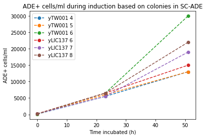

​
# Title : PLANNING 160621-SATAY_of_yLIC137_and_yTW001
​
## Date
16062021 -
​
## Objective
​
- To perform SATAY on bem3d (yLIC137) and bem1bem3d (yTW001) strains.
​
## Method
- Requirements pre-culture
  - [x] 6 sterile flasks
  - [x] 6*20=120ml of SC-Ura+Ade + 0.2% Dex + 2% Raffinose
  - [x] Incubator
- Requirements induction:
  - [x] 6 sterile flasks
  - [x] 3*6=18 agar plates of the following types:
    - [x] SC-Ade
    - [x] SC-Ura+Ade
    - [x] CSM+Ade
  - [x] 6*150=900ml of SC-Ura+Ade + 2% Galactose
- Requirements reseed
  - [x] 4 5L flasks
  - [x] 4*2.3L autoclaved milliQ
  - [x] 4*200=800ml concentrated SC-ADE - Dex
  - [x] 4*300=1200ml 20% D-Glucose

- **18062021**
  - Preparing 20 (=400ml) plates of
      - [x] SC-Ade
      - [x] SC-Ura+Ade
      - [x] CSM+Ade

  - Preparing media
      - [x] 200ml SC-Ura+Ade + 0.2% Dex + 2% Raffinose
      

- **21062021**
  - Preparing media
      - [x] 4*300ml = 1200 ml 20% D-Glucose
      - [x] 900ml SC-Ura+Ade + 2% Galactose
      - [x] 4*200=800ml concentrated SC-ADE - Dex

- **22062021**
  - [x] Preculture in SD-URA+Ade+0.2%glucose +2% raffinose
      - Scrape colonies from 6 backgrounds that passed the sanity check
          - Colonies indicated by a large dot on the -Ade plates. Repeating all yTW001 colonies and yLIC137 4
      - 20ml media in flask
      - Incubate at 30C, 180 RPM
      - Time start of preculture: 11:00

    | Name | Colony |
    |-|-|
    | yTW001 4 | yTW001 C8 |
    | yTW001 5 | yTW001 C7 |
    | yTW001 6 | yTW001 C2 |
    | ylic137 6 | yLIC137_2 C8 |
    | ylic137 7 | yLIC137_1 C2 |
    | ylic137 8 | yLIC137_1 C4 |

- **23062021**
    - End of preculture, start of induction

    - Remove flasks from incubator incubate 22h
    - Time end of preculture: 09:00
    - OD measurement end of preculture:

    | Strain  |  OD 20x dilution  | ReaL OD | Approximate dilution Factor to OD=0.2  |
    |-|-|-|-|-|
    | yTW001 4 | 0.115 | 2.30 | 10x |
    | yTW001 5 | 0.116 | 2.32 | 10x |
    | yTW001 6 | 0.204 | 4.08 | 20x |
    | ylic137 6 | 0.208 | 4.16 | 20x |
    | ylic137 7 | 0.271 | 5.42 | 25x |
    | ylic137 8 | 0.366 | 7.32 | 30x |

    - Dilute cells to OD of 0.2 in SD-Ura+Ade+2% galactose for a total volume of 150ml
    - Induce for 50h-52h: 30C, 180rpm (START AT 11:00)

    - OD measurement start of induction: 

    | Strain  | OD |
    |-|-|
    | yTW001 4 | 0.285 |
    | yTW001 5 | 0.138 |
    | yTW001 6 | 0.236 |
    | ylic137 6 | 0.223 |
    | ylic137 7 | 0.224 |
    | ylic137 8 | 0.228 |

    
    - Measure the background (T=0 of induction)
      - [x] Plate 200ul of the inoculum in SD-ADE+ 2% dextrose (expect 40-80 colonies per 200uL)
      - [x] Dilute 1000x and spread 200ul in SD-URA and CSM + ADE

    
- **24062021** 

- Measure the rate of induction at T=23h of induction (10:00)
  - [x] Plate 200ul of the inoculum 10x diluted in SD-ADE+ 2% dextrose (expect 40-80 colonies per 200uL)
  - [x] Dilute 1000x and spread 200ul in SD-URA and CSM + ADE
  - [x] Check OD

- OD measurement afer T=23 hours
​
| Strain  |  OD 20x dilution  | ReaL OD |
|---|---|---|
| yTW001 4 | 0.350 | 7.00 |
| yTW001 5 | 0.369 | 7.38 |
| yTW001 6 | 0.415 | 8.30 |
| ylic137 6 | 0.520 | 10.4 |
| ylic137 7 | 0.490 | 9.80 |
| ylic137 8 | 0.506 | 10.1 |

- [x] 4 times: Dissolve 2.34g of CSM-ade + 20.1g of YNB in 400ml MQ and filter sterilize it 
- [x] Prepare 4 flasks of 3L of SD-ADE media for the reseed of four strains
    - Per flask:
    - [x] Add 2,3L MiliQ to flask and autoclave
    - [x] Add 400ml concentrated SC-ADE media to autoclaved MiliQ flask 
    - [x] Add 300mL of 20% dextrose

- **25062021**

- Measure the rate of induction (T=51h of induction) (AT 14:00)
​    - [x] Plate 200ul of the inoculum 200x diluted in SD-ADE+ 2% dextrose (expect 40-80 colonies per 200uL)
​    - [x] Dilute 40000x and spread 200ul in SD-URA and CSM + ADE
    - [x] Check OD 
    - [x] Check number of colonies in T=0 plates

- Colony count at of T=0 plates at T=51 on -ADE

  | Strain  | Count |
  |-|-|
  | yTW001 4 | 1 |
  | yTW001 5 | 0 |
  | yTW001 6 | 1 |
  | ylic137 6 | 3 |
  | ylic137 7 | 2 |
  | ylic137 8 | 3 |

- OD measurement afer (T=51) hours
​

| Strain  |  OD 40x dilution  | ReaL OD | Dilution for OD of 0.1 |
|---|---|---|---|
| yTW001 4 | 0.197 | 7.88  | 80x |
| yTW001 5 | 0.202 | 8.08 | 80x |
| yTW001 6 | 0.258 | 10.32 | 100x |
| ylic137 6 | 0.257 | 10.28 | 100x |
| ylic137 7 | 0.270 | 10.8 | 100x |
| ylic137 8 | 0.278 | 11.12 | 110x |

- Choose 4 strains to continue for the reseed that has the least number of ADE+ cells at T=0 and the highest number of ADE+ after induction.
  - Based on background at T=0 (plates).
  - Or highest OD at end of induction if no colonies are visible
  - Continue with yTW001 4, 6, yLIC137 7, 8.
  - Start reseed with OD of 0.1. 
  - Incubate at 30C, 120 rpm
  - Start at 16:45

  - OD measurement start of reseed: 

    | Strain  | Diluted | OD |
    |-|-|-|
    | yTW001  4 | 60x | 0.112 |
    | yTW001  6 | 60x | 0.111 |
    | ylic137 7 | 90x | 0.103 |
    | ylic137 8 | 90x | 0.098 |

- **29062021**

- Reseed stopped at 13:00 (92h)

- [] Check ADE+ cells during induction. Counting colonies from each plate. 
  - Image J protocol: 
    1. select image of interest: circle tool and edit-> clear outside (clear so that just all text is removed)
    2. Image ->  Type -> 16bits
    3. Make sure to capture the maximum number of right colonies: Image -> Adjust -> Threshold . Make sure the colonies are all red.
    4. Process -> Make binary-> Watershed
    5. Analyse ->  Analyse Particles

| plate&strain | t=0 (undiluted) | t=23 (10x diluted) | t=51 (200x diluted) |
|-|-|-|-|
| yTW001 4 -ADE | 18 | 110 | 13 |
| yTW001 5 -ADE | 22 | 120 | 13 |
| yTW001 6 -ADE | 23 | 130 | 30 |
| yLIC137 6 -ADE | 42 | 130 | 15 |
| yLIC137 7 -ADE | 39 | 110 | 19 |
| yLIC137 8 -ADE | 40 | 130 | 22 |

| plate&strain | t=0 (1000x) | t=23 (1000x diluted) | t=51 (40000x diluted) |
| yTW001 4 +ADE | 13 | 271 | 37 |
| yTW001 5 +ADE | 9 | 566 | 22 |
| yTW001 6 +ADE | 20 | 0 | 30 |
| yLIC137 6 +ADE | 21 | 0 | 110 |
| yLIC137 7 +ADE | 23 | 935 | 80 |
| yLIC137 8 +ADE | 7 | 1057 | 32 |
| yTW001 4 -URA+ADE | 13 | 1169 | 70 |
| yTW001 5 -URA+ADE | 14 | 0 | 24 |
| yTW001 6 -URA+ADE | 5 | 0 | 100 |
| yLIC137 6 -URA+ADE | 2 | 0 | 100 |
| yLIC137 7 -URA+ADE | 29 | 1119 | 100 |
| yLIC137 8 -URA+ADE | 4 | 243 | 100 |

- OD measurement of the reseed (T=92h):

| Strain  |  OD x40 dilution  | ReaL OD |
|---|---|---|
| yTW001 4 | 0.192 | 7.68 |
| yTW001 6 | 0.278 | 11.12 |
| ylic137 7 | 0.244 | 9.76 |
| ylic137 8 | 0.223 | 8.92 |

- [x] Plate 200ul with 1000X dilution in SD-Ade , and 200ul with 40000X dilution in SD-ura to estimate the growth of ade+cells compared with the T=0 of reseeding. Expect  that the ade+ cells have grown by a factor of ~1000x. 

- End of reseeding after 92 hours (END AT 12:00)
- [x] Harvest of the cell culture.
  - Centrifuge per 1L (3 times for 3L) for 20 min at 4500rpm
  - Move pellet to 50ml centrifuge tube
  - Centrifuge 14 min at 3000rpm
  - Store pellet at -80C

  

  - Library to reseed
  - [Rule of thumb for the number of cells under certain OD600](https://research.fhcrc.org/content/dam/stripe/hahn/methods/yeast_genetics/yeast_OD_cells.pdf) 
​
  | OD  |  approx Number of cells in 1mL| 
  |---|---|
  | 0.1 | 3,000,000  |
  | 0.18 | 6,000,000  |
  | 0.25  | 7,500,000 |
  | 0.27  | 7,500,000 | 
  | 1| 30,000,000 | 
​
​ ​| strain  |  OD at T=0 (reseed)| Volume | Library 
  |---|---|---|---|
  | yTW001  | 0.112 | 3L |3000*1.12*3,000,000 = 1.0*10^10|
  | yTW001  | 0.111 | 3L |3000*1.11*3,000,000 = 1.0*10^10|
  | yLIC137   | 0.103 | 3L |3000*1.03*3,000,000 = 9.3*10^9| 
  | yLIC137   | 0.098 | 3L |3000*0.98*3,000,000 = 8.8*10^9|
 

| Strain 	| OD START 	| OD STOP 	| ADE+/mL-start induct(backg) 	| ADE+/mL-start Reseed 	| ADE+/ml-stop Reseed 	| URA+/ml-stop Reseed 	| % of ade+/ura+ 	| Total # of cells Harvest 	| Time- Reseeding 	|
|-	|-	|-	|-	|-	|-	|-	|-	|-	|-	|
| yTW001 4 | 0.112	|	7.68 | 90	| 215	|  	|  	| 	| 6.9*10^11	| 92h	|
| yTW001 6 | 0.111	|	11.12 | 115	| 374	|  	|  	| 	| 1.0*10^12	| 92h |
| yLIC137 7 | 0.103	|	9.76 | 195	| 209	|  	|  	| 	| 8.8*10^11	| 92h	|
​| yLIC137 8 | 0.098 | 8.92 | 200 | 242 |   |   | 	 | 8.0*10^11 | 92h |

