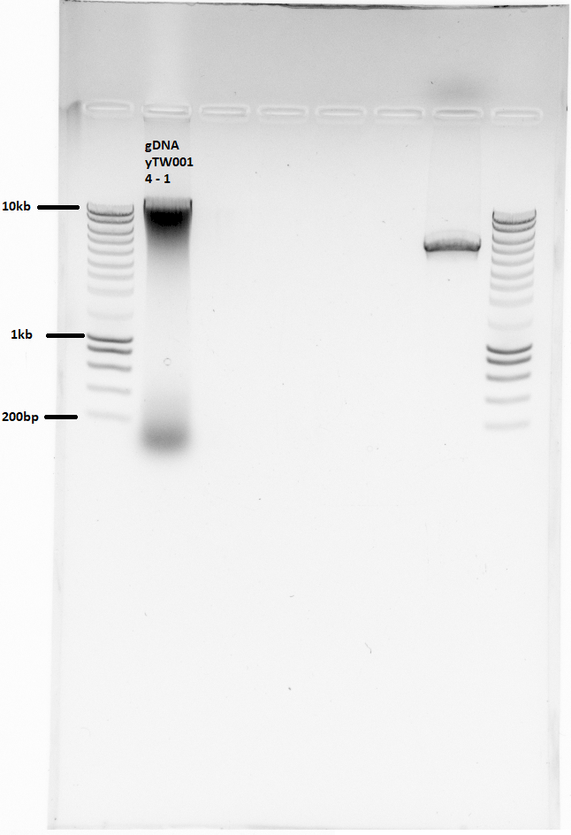
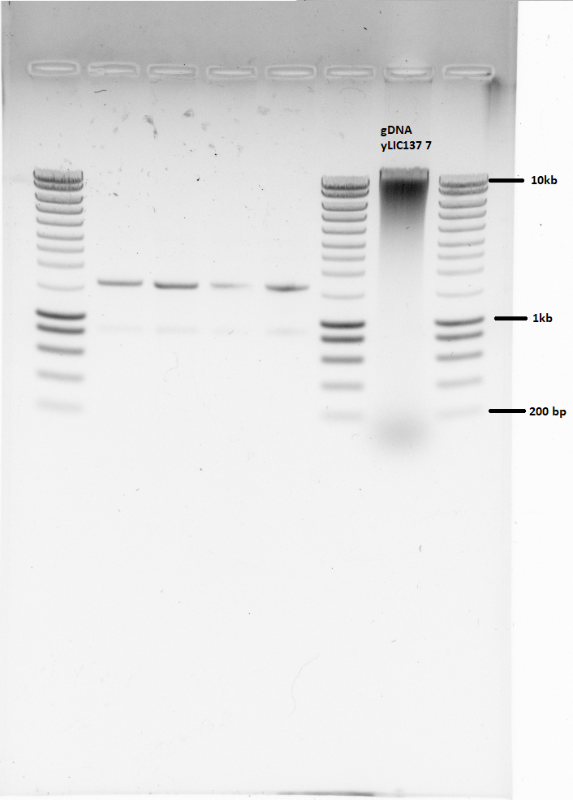
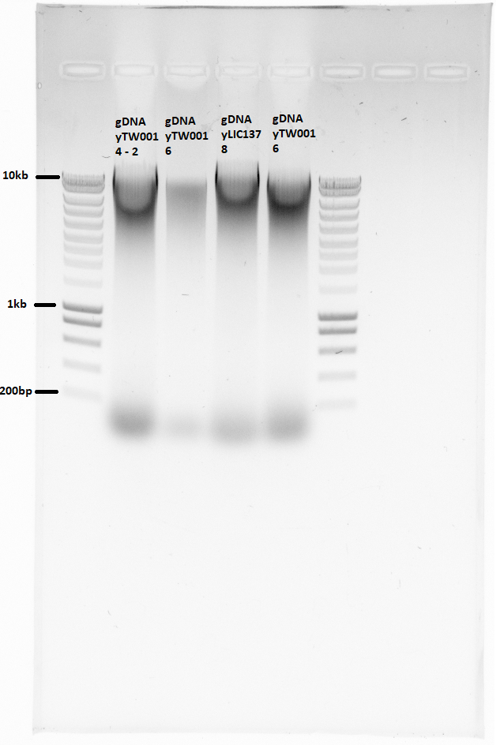

​
# Title : 05-07-21: DNA extraction of SATAY pellet
​
## Date
05/07/21 - 09/07/21
​
## Objective
​
- To extract DNA from SATAY pellet for later sequencing
​

## Materials
- [x] 500 mg cell pellet (from SATAY)
- [x] Cell breaking buffer
- [x] Per alicot: 200 ul of Phenol:Chloroform:Isoamylalcool 25:25:1
- [x] Per alicot: 300 ul 0.5mm glass beads (From genomic DNA extraction kit, 3 aliquots per strain)
- [x] TE
- [x] 100% EtOH
- [x] RNAse A
- [x] NaOAc 3M
- [x] 70% EtOH
- [x] H2O
- [x] Agarose gel

## Method

- based on Benoit's protocol, adapted by [Leila](https://leilaicruz.github.io/Experimental-journal-jupyterBOOK/journal/2020-08/2020-08-18-DNA-Prep-SATAY.html?highlight=dna%20satay)

- Mix pellet & cell breaking buffer 1:1 by pipetting

 **05072021**

- yTW001 4: 697g of pellet
- Aliquot into 2 eppis
- step 3: vortexed at 20C instead of 4C
- step 7: No stirring & heating. So switching between heating and sometimes vortexing.
  - Sample may have been cooler than 55C. Heater used was the shaker...
- step 8: 0.1 vol is assumed to be 70uL, unclear.
- step 10: same conditions are assumed to be 500uL, 5min at 16100 g. No NaOAc
- step 11: 25uL of water used per aliquot. Again switching between heating and vortexing. Ideally here we should mix by pipetting
- gel: 10uL loaded, 120V for 30min

Measuring DNA concentration on gel with image j:

- Using [Gels Submenu](https://imagej.nih.gov/ij/docs/menus/analyze.html#gels)
- select entire lane with rectangle selection tool
- Analyze>Gels>Select First Lane
- Move selection to second lane
- Analyze>Gels>Select Next Lane
- Analyze>Gels>Plot Lanes
- Use the straight line selection tool to draw base lines and/or drop lines so that each peak of interest defines a closed area.
- For each peak, measure the size by clicking inside with the wand tool.
- Analyze>Gels>Label Peaks

- The area gives the size of the peak. Compare size peak of interest to size of peak corresponding to ladder peak with known concentration.
- Final DNA concentration: 135 ng/ul, in ~110ul

**07072021**

- yLIC137 7: 3* ~670mg of pellet
- aliquot each into 4 eppis
- step 11: 25uL of water used per aliquot. Again switching between heating and vortexing. Mixing by pipetting did not seem to work.
- Gel: 10uL loaded (ran by Reza!)
- Final DNA concentration: 81 ng/ul (~350 ul)

**08072021**

- yLIC137 8: 3* ~627mg of pellet
- aliquot each into 4 eppis
- step 11: 25uL of water used per aliquot. Again switching between heating and vortexing. Mixing by pipetting did not work.
- Final DNA concentration: 127 ng/ul, (~350ul)

**09072021**

- yTW001 4: 2\*666mg of pellet
- yTW001 6: 2\*668mg of pellet
- aliquot each into 4 eppis
- Final DNA concentrations
- yTW001 4 230uL of 134 ng/ul
- yTW001 6 230uL of 128 ng/ul

